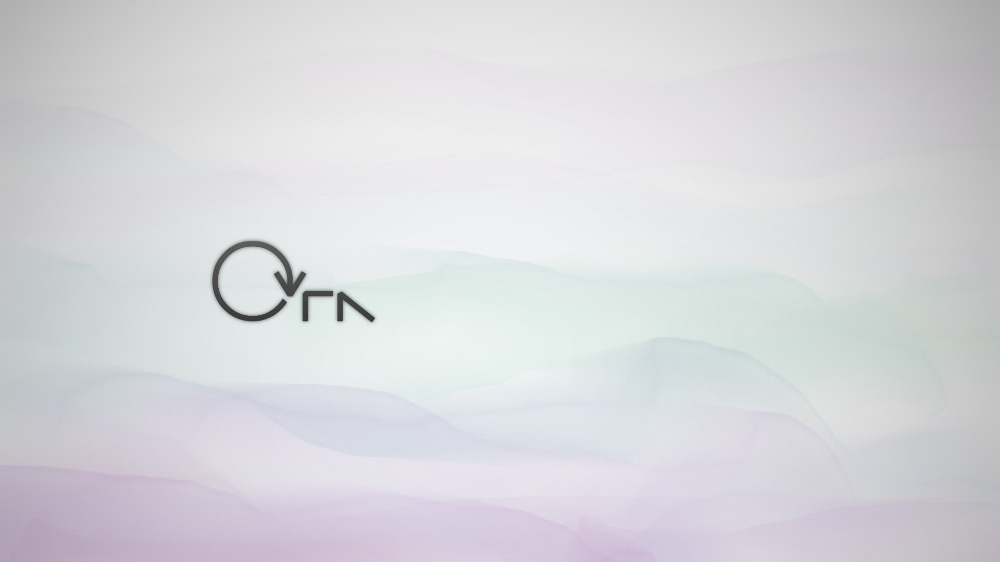
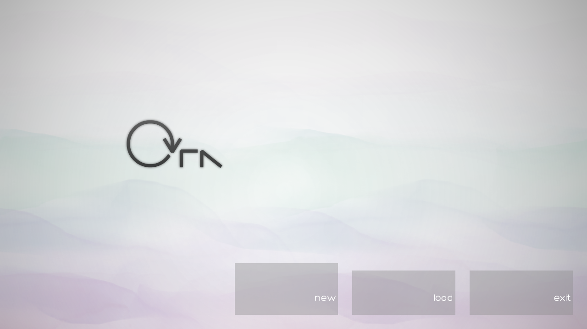
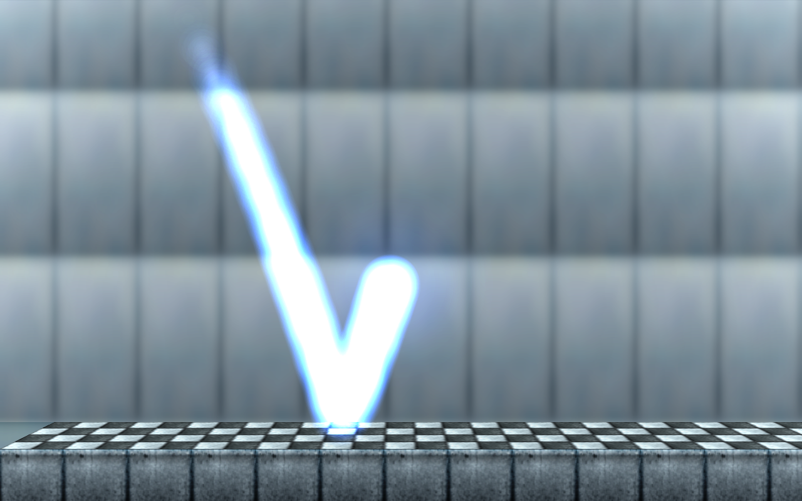
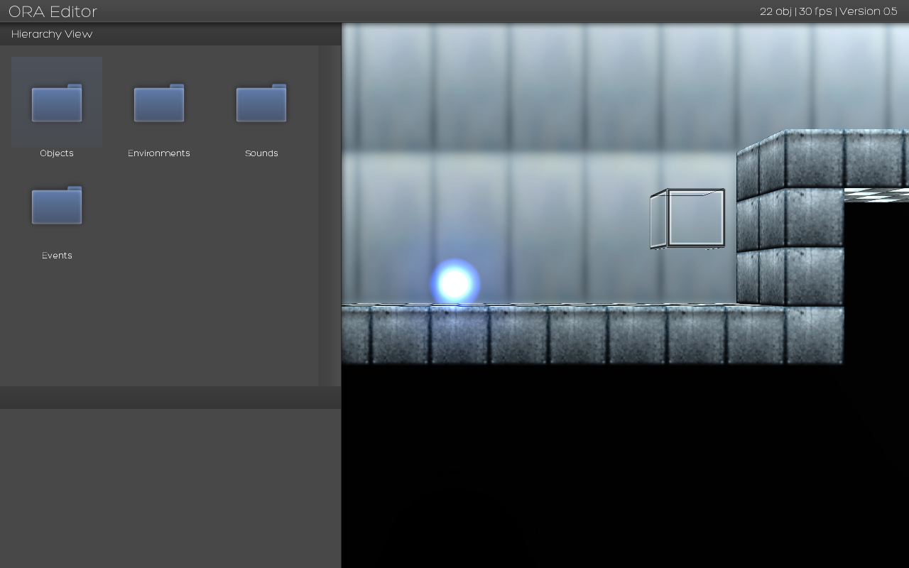
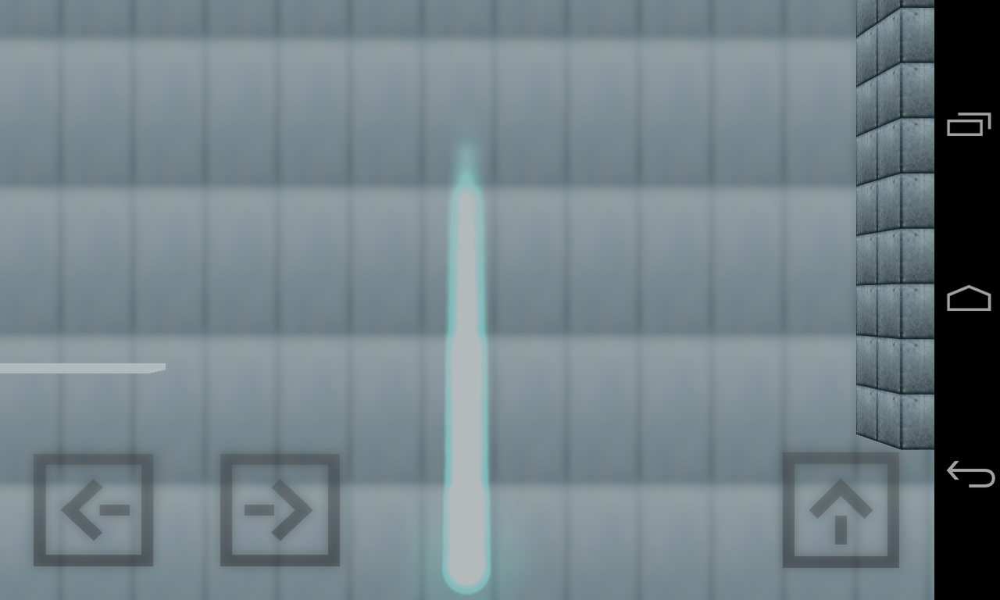

[![License][license-img]][license-url]
[![Steam][steam-img]][steam-url]

A game where you're a blur of light trying to escape an encroaching darkness. Ora is a game I made in 2012 that was a finalist for the Game Maker Studio Steam Workshop competition.

## Screenshots

|  |    |
| :--------------------------------: | :-------------------------------------: |
|   |  |

## Controls

- **Arrow Keys** - Move / Jump
- **Up** - Jump / Hold Up to Reflect off walls.
- **Tilde/Tick** - Open Console. Type `help` for cheat codes.

Alternatively, you can plug in a gamepad and it will automatically be recognized.

[license-img]: http://img.shields.io/:license-mit-blue.svg?style=flat-square
[license-url]: https://opensource.org/licenses/MIT
[steam-url]: https://steamcommunity.com/sharedfiles/filedetails/?id=101432890&tscn=1350763601
[steam-img]: https://img.shields.io/badge/steam-workshop-2a2a2a.svg?style=flat-square
