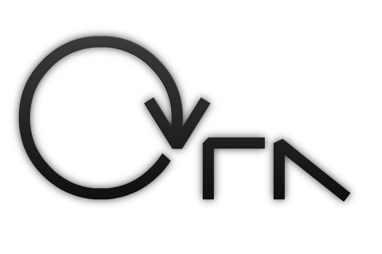

Complete source for Ora, a game I made in 2012 where a ball of light tries to escape an encroaching darkness. 

## Screenshots

|  |  |
|:-:|:-:|
|  |  |

<iframe width="640" height="360" src="https://www.youtube.com/embed/-kXZ0GLl9TQ" frameborder="0" allowfullscreen></iframe>

## Controls

- **Arrow Keys** - Move / Jump
- Hold **Up** to Reflect off walls. 

Alternatively, you can plug in a gamepad and it will automatically be recognized. 

[license-img]: http://img.shields.io/:license-mit-blue.svg?style=flat-square
[license-url]: https://opensource.org/licenses/MIT  
[steam-url]: steamcommunity.com/sharedfiles/filedetails/?id=101432890&tscn=1350763601
[steam-img]: https://img.shields.io/badge/steam-workshop-2a2a2a.svg?style=flat-square